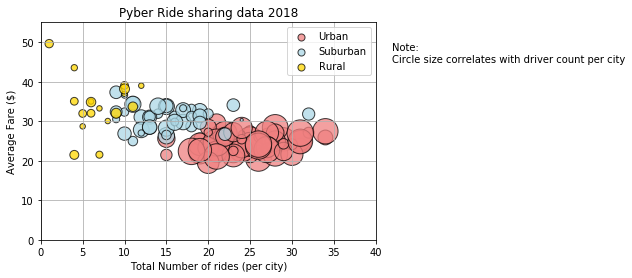
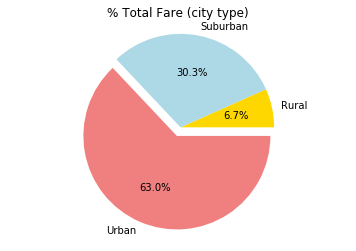
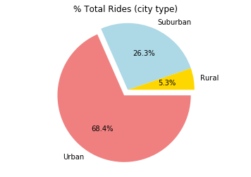
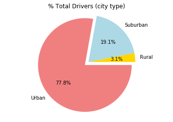

Observed Trends:
1. Even though there is a much larger number of drivers in urban areas than in suburban or rural, the average fare prices are much lower. This could be due to the fact that there are many other modes of transportation in urban areas and the drivers in these cities would have to compete for passengers. This in turn would cause the fares to lower. On the other, rural drivers have the option of hiking up their prices because their passengers won't have many other options and will have to take the modes of transportation they can get.
2. The pie charts showing % of Total Fares by City Type, % of Total Rides by City Type, and % of Drivers by City Type make it quite clear that demand for Uber is extremely high in urban areas.
3. Due to the size of the bubbles in the bubble plot, which correlates to the number of drivers in a city, we can infer that the population in urban areas is higher than that in suburban or rural areas. This can be assumed because there are many more drivers in urban areas indicating that there is a larger need for rides in those areas.


```python
# Import required libraries and read the files into dataframe
import pandas as pd
import numpy as np
import matplotlib.pyplot as plt
import seaborn as sns


file1 = ("raw_data/city_data.csv")
file2 = ("raw_data/ride_data.csv")

city_data_df = pd.read_csv(file1)
ride_data_df = pd.read_csv(file2)

```


```python
#Merge dataframes 

city_ride_df1 = pd.merge(ride_data_df,city_data_df, how = 'inner',on = 'city')
#city_ride_df.to_csv("city_ride.csv",sep =",")
city_ride_df = city_ride_df1.drop_duplicates(subset=["fare","ride_id"],keep="first")
city_ride_df.head()
```


<div>
<style scoped>
    .dataframe tbody tr th:only-of-type {
        vertical-align: middle;
    }

    .dataframe tbody tr th {
        vertical-align: top;
    }

    .dataframe thead th {
        text-align: right;
    }
</style>
<table border="1" class="dataframe">
  <thead>
    <tr style="text-align: right;">
      <th></th>
      <th>city</th>
      <th>date</th>
      <th>fare</th>
      <th>ride_id</th>
      <th>driver_count</th>
      <th>type</th>
    </tr>
  </thead>
  <tbody>
    <tr>
      <th>0</th>
      <td>Sarabury</td>
      <td>2016-01-16 13:49:27</td>
      <td>38.35</td>
      <td>5403689035038</td>
      <td>46</td>
      <td>Urban</td>
    </tr>
    <tr>
      <th>1</th>
      <td>Sarabury</td>
      <td>2016-07-23 07:42:44</td>
      <td>21.76</td>
      <td>7546681945283</td>
      <td>46</td>
      <td>Urban</td>
    </tr>
    <tr>
      <th>2</th>
      <td>Sarabury</td>
      <td>2016-04-02 04:32:25</td>
      <td>38.03</td>
      <td>4932495851866</td>
      <td>46</td>
      <td>Urban</td>
    </tr>
    <tr>
      <th>3</th>
      <td>Sarabury</td>
      <td>2016-06-23 05:03:41</td>
      <td>26.82</td>
      <td>6711035373406</td>
      <td>46</td>
      <td>Urban</td>
    </tr>
    <tr>
      <th>4</th>
      <td>Sarabury</td>
      <td>2016-09-30 12:48:34</td>
      <td>30.30</td>
      <td>6388737278232</td>
      <td>46</td>
      <td>Urban</td>
    </tr>
  </tbody>
</table>
</div>


```python
#Urban,Sub-urban,Rural Dataframes
urban_df = city_ride_df.loc[city_ride_df["type"]=="Urban"]
surban_df = city_ride_df.loc[city_ride_df["type"]=="Suburban"]
rural_df = city_ride_df.loc[city_ride_df["type"]=="Rural"]
```


```python
#Total Rides per city
urban_rides = urban_df.groupby("city")["ride_id"].count()
surban_rides = surban_df.groupby("city")["ride_id"].count()
rural_rides = rural_df.groupby("city")["ride_id"].count()

#Avg Fare per city 
urban_avg = round(urban_df.groupby("city")["fare"].mean(),2)
surban_avg = round(surban_df.groupby("city")["fare"].mean(),2)
rural_avg = round(rural_df.groupby("city")["fare"].mean(),2)

#Total Drivers per city
urban_df_unique = urban_df.drop_duplicates(subset=["city","driver_count"], keep='first')
surban_df_unique = surban_df.drop_duplicates(subset=["city","driver_count"], keep='first')
rural_df_unique = rural_df.drop_duplicates(subset=["city","driver_count"], keep='first')

urban_drivers = urban_df_unique.groupby("city")["driver_count"].sum()
surban_drivers = surban_df_unique.groupby("city")["driver_count"].sum()
rural_drivers = rural_df_unique.groupby("city")["driver_count"].sum()

urban_plot_df = pd.DataFrame({"Urban Avg": urban_avg,"Urban Rides":urban_rides,"Urban Drivers":urban_drivers})
surban_plot_df = pd.DataFrame({"Suburban Avg": surban_avg,"Suburban Rides":surban_rides,"Suburban Drivers":surban_drivers})
rural_plot_df = pd.DataFrame({"Rural Avg": rural_avg,"Rural Rides":rural_rides,"Rural Drivers":rural_drivers})

plt.scatter(urban_rides,urban_avg,s=urban_drivers*10,color = 'lightcoral', edgecolor='black',label='Urban',alpha=0.75)
plt.scatter(surban_rides,surban_avg,s=surban_drivers*10,color = 'lightblue', edgecolor='black',label='Suburban',alpha=0.75)
plt.scatter(rural_rides,rural_avg,s=rural_drivers*10,color = 'gold', edgecolor='black',label='Rural',alpha=0.75)
plt.title('Pyber Ride sharing data 2018')
plt.xlabel('Total Number of rides (per city)')
plt.ylabel('Average Fare ($)')
plt.xlim(0, 40)
plt.ylim(0, 55)
lgnd = plt.legend(scatterpoints=1)
lgnd.legendHandles[0]._sizes = [50]
lgnd.legendHandles[1]._sizes = [50]
lgnd.legendHandles[2]._sizes = [50]
plt.annotate(s='Note:\nCircle size correlates with driver count per city', xy=(0,15), xytext=(42,45))
plt.grid()
plt.show()

```





```python
#Total Fare by city type
total_fare = round(city_ride_df.groupby("type")["fare"].sum(),1)
plt.pie(total_fare,explode=(0,0,0.1),colors = ["gold", "lightblue", "lightcoral"],autopct="%1.1f%%", labels=["Rural","Suburban","Urban"])
plt.axis("equal")
plt.title("% Total Fare (city type)")
plt.show()

```





```python
#Total Rides by city type
total_rides = city_ride_df.groupby("type")["ride_id"].count()
plt.pie(total_rides,explode=(0,0,0.1),colors = ["gold", "lightblue", "lightcoral"],autopct="%1.1f%%", labels=["Rural","Suburban","Urban"])
plt.axis("equal")
plt.title("% Total Rides (city type)")
plt.show()

```





```python
#Total Drivers by city type
city_ride_dup = city_data_df.drop_duplicates(["city","driver_count"],keep='first')
total_drivers = city_ride_dup.groupby("type")["driver_count"].sum()
plt.pie(total_drivers,explode=(0,0,0.1),colors = ["gold", "lightblue", "lightcoral"],autopct="%1.1f%%", labels=["Rural","Suburban","Urban"])
plt.axis("equal")
plt.title("% Total Drivers (city type)")
plt.show() 

```




